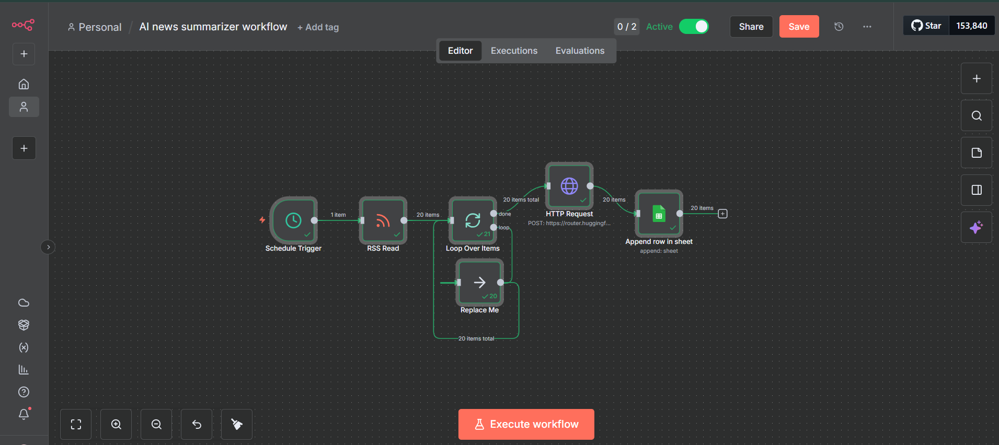

# n8n AI News Summarizer

## 🚀 Overview

This is an automated n8n workflow that fetches the latest technology news, uses the Hugging Face AI to summarize each article, and saves the results to a Google Sheet.

This project was built to demonstrate skills in API integration, data automation (ETL), and practical AI implementation.

---

## ✨ Features

* **Automated Fetching:** Runs on a daily schedule to get the latest news from a tech RSS feed (e.g., TechCrunch).
* **AI Summarization:** Connects to the free Hugging Face Inference API to perform abstractive summarization on each article.
* **Data Storage:** Loops through each article and appends the title, original link, and AI-generated summary to a Google Sheet for easy reading.
* **Secure:** Uses n8n's built-in credential management to keep API keys safe.

---

## 🛠️ Tech Stack

* **Automation:** [n8n](https://n8n.io/) (Desktop App / Cloud)
* **Data Source:** RSS Feed (e.g., The Verge, TechCrunch)
* **AI Model:** [Hugging Face Inference API](https://huggingface.co/docs/inference-providers/index) (using the `sshleifer/distilbart-cnn-12-6` model)
* **Data Output:** [Google Sheets](https://www.google.com/sheets/about/)

---

## 🔧 How to Use

1.  **Download:** Download the `workflow.json` file from this repository.
2.  **Import:** Open your n8n canvas, click on the blank background, and press **Ctrl+V** (or Cmd+V) to paste the workflow.
3.  **Credentials:**
    * **Hugging Face:** The `HTTP Request` node is set to use a credential named `HuggingFace API Key`. Create a new "Generic Credential" with this name and add your API key.
    * **Google Sheets:** Authenticate the `Google Sheets` node with your own Google account.
4.  **Configure:** Update the `Google Sheets` node with your own **Spreadsheet ID**.
5.  **Activate!**
